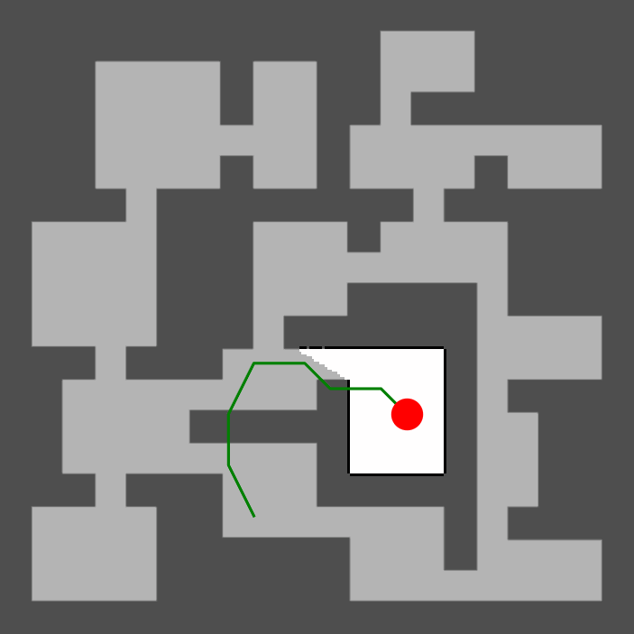

<h1 align="center"> DARE: Diffusion Policy to Autonomous Robotics Exploration </h1>

<div align="center">

[](https://arxiv.org/abs/2410.16687)
[](https://ubuntu.com/blog/tag/22-04-lts)
[]()



</div>

---

### Installation

1. **Create the conda environment**:

	```bash
	conda create -n env_dare python=3.12.9 -y
	```

2. **Activate the environment**:

	```bash
	conda activate env_dare
	```

3. **Clone this repository:**
   ```bash
   git clone https://github.com/marmotlab/DARE.git
   ```

4. **Install this repository in editable mode** (from the repo root):

	```bash
    cd DARE
	pip install -e .
	```

---

### Dataset Collection
Modify `dataset_parameter.py` to fit your dataset needs then run dataset collection script:
```bash
python dataset_driver.py
```

Dataset will be saved to directory `diffusion_exploration/dataset/name_of_test`.
It will include a `data.zarr` directory which contains the dataset and a `gifs` directory.

### Training Policy
Copy desired training config file from `diffusion_exploration/diffusion_policy/config`.
Modify desired task config file from `diffusion_exploration/diffusion_policy/config/task`.

**Note:** You probably should modify the `zarr_path` to change dataset location

You can run the training script which requires two arguements:
1. `--config-dir` which is the directory to find the config file
2. `--config-name` which is the name of the config file

```bash
python train.py --config-dir=. --config-name=train_exploration_transformer_node_discrete.yaml
```

This will create a directory `diffusion_exploration/data/date/time/name_of_run`

### Evaluate trained model
Modify `test_parameter.py` to fit your test needs then run evaluation script:
```bash
python test_driver.py
```

Test results will be printed on terminal and saved as a CSV
`inference_gifs` directory will be created in `diffusion_exploration/data/date/time/name_of_run`.

## Credit
If you find this work useful, please consider citing us and the following works:

+ DARE: Diffusion Policy for Autonomous Robot Exploration

```bibtex
@inproceedings{cao2025dare,
  author={Cao, Yuhong and Lew, Jeric and Liang, Jingsong and Cheng, Jin and Sartoretti, Guillaume},
  booktitle={2025 IEEE International Conference on Robotics and Automation (ICRA)}, 
  title={DARE: Diffusion Policy for Autonomous Robot Exploration}, 
  year={2025},
  pages={11987-11993},
  doi={10.1109/ICRA55743.2025.11128196}}
}
```

+ ARiADNE: A Reinforcement learning approach using Attention-based Deep Networks for Exploration

```bibtex
@inproceedings{cao2023ariadne,
  author={Cao, Yuhong and Hou, Tianxiang and Wang, Yizhuo and Yi, Xian and Sartoretti, Guillaume},
  booktitle={2023 IEEE International Conference on Robotics and Automation (ICRA)}, 
  title={ARiADNE: A Reinforcement learning approach using Attention-based Deep Networks for Exploration}, 
  year={2023},
  pages={10219-10225},
  doi={10.1109/ICRA48891.2023.10160565}
  }
```

+ Deep Reinforcement Learning-based Large-scale Robot Exploration

```bibtex
@article{cao2024deepreinforcementlearningbasedlargescale,
  author={Cao, Yuhong and Zhao, Rui and Wang, Yizhuo and Xiang, Bairan and Sartoretti, Guillaume},
  journal={IEEE Robotics and Automation Letters}, 
  title={Deep Reinforcement Learning-Based Large-Scale Robot Exploration}, 
  year={2024},
  volume={9},
  number={5},
  pages={4631-4638},
  keywords={Training;Planning;Predictive models;Simultaneous localization and mapping;Trajectory;Three-dimensional displays;Reinforcement learning;Path planning;Robot learning;View Planning for SLAM;reinforcement learning;motion and path planning},
  doi={10.1109/LRA.2024.3379804}
}
```

+ Diffusion policy: Visuomotor policy learning via action diffusion

```bibtex
@inproceedings{chi2023diffusionpolicy,
	title={Diffusion Policy: Visuomotor Policy Learning via Action Diffusion},
	author={Chi, Cheng and Feng, Siyuan and Du, Yilun and Xu, Zhenjia and Cousineau, Eric and Burchfiel, Benjamin and Song, Shuran},
	booktitle={Proceedings of Robotics: Science and Systems (RSS)},
	year={2023}
}

@article{chi2024diffusionpolicy,
	author = {Cheng Chi and Zhenjia Xu and Siyuan Feng and Eric Cousineau and Yilun Du and Benjamin Burchfiel and Russ Tedrake and Shuran Song},
	title ={Diffusion Policy: Visuomotor Policy Learning via Action Diffusion},
	journal = {The International Journal of Robotics Research},
	year = {2024},
}
```

We build on the codebase from [Deep Reinforcement Learning-based Large-scale Robot Exploration](https://github.com/marmotlab/large-scale-DRL-exploration) and [Diffusion policy](https://github.com/real-stanford/diffusion_policy).

<!--
TODO
1. News / TODO
2. Intro
3. Code Structure
4. Pictures
5. weights
6. Emojis
-->